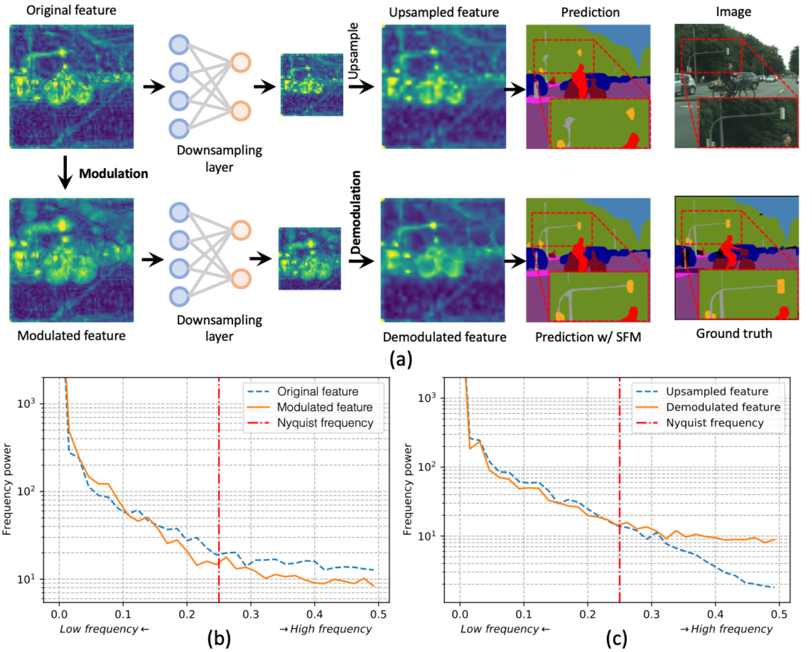
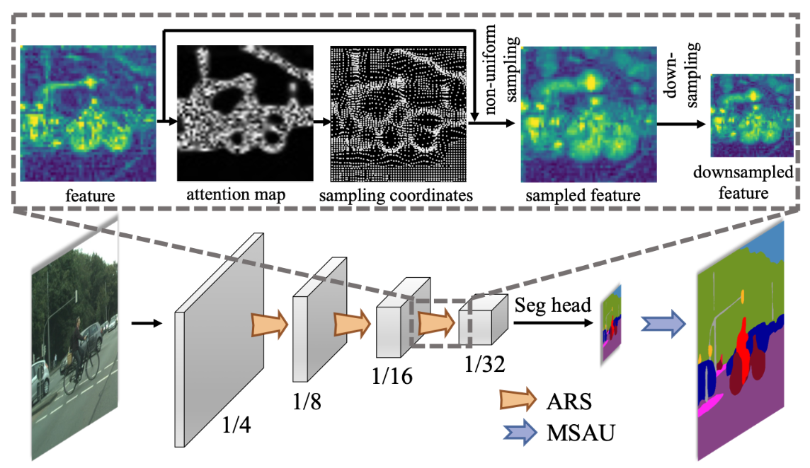

# Spatial Frequency Modulation for Semantic Segmentation

This repository contains implementation for the paper: **Spatial Frequency Modulation for Semantic Segmentation** (Accepted by IEEE Transactions on Pattern Analysis and Machine Intelligence, 2025).



In this work, we identify and address the "aliasing degradation" problem in modern deep neural networks, where high-frequency information crucial for semantic segmentation is distorted during downsampling.

Instead of simply filtering out these valuable details, we introduce **Spatial Frequency Modulation (SFM)**, a novel framework that:

1. **Modulates** high-frequency features to a lower frequency band *before* downsampling, protecting them from aliasing.
2. **Demodulates** these features back to their original high frequency during upsampling, recovering fine-grained details for a more accurate segmentation.

Our lightweight and plug-and-play modules, **Adaptive Resampling (ARS)** and **Multi-Scale Adaptive Upsampling (MSAU)**, can be seamlessly integrated into various CNN and Transformer architectures to significantly boost their performance.



> **Figure:** An illustration of our SFM framework. Adaptive Resampling (ARS) is inserted before downsampling layers to perform frequency modulation, and Multi-Scale Adaptive Upsampling (MSAU) is used to demodulate the features and produce the final high-resolution segmentation map.

## Main Contributions

- **Identifying "Aliasing Degradation":** We quantitatively demonstrate that a higher aliasing ratio in feature maps leads to lower segmentation accuracy, providing a clear motivation for frequency-aware network design.
- **Spatial Frequency Modulation (SFM):** We propose a novel framework to preserve high-frequency details by modulating them to lower frequencies to survive downsampling, and then demodulating them to recover the details.
- **Lightweight and Effective Modules:** We implement SFM with two novel modules:
  - **Adaptive Resampling (ARS):** A lightweight module that learns to densely sample high-frequency regions (e.g., boundaries, textures) to effectively lower their frequency representation.
  - **Multi-Scale Adaptive Upsampling (MSAU):** A module that performs non-uniform upsampling to reverse the modulation and refines segmentation details by modeling multi-scale pixel relationships.
- **Broad Applicability:** Our method is model-agnostic and consistently improves various state-of-the-art segmentation models, including CNN-based (ResNet, ConvNeXt, InternImage) and Transformer-based (Swin) architectures, with minimal computational overhead.

## Installation

This project is based on [MMSegmentation](https://www.google.com/url?sa=E&q=https%3A%2F%2Fgithub.com%2Fopen-mmlab%2Fmmsegmentation). Please follow the steps below for installation.

**1. Prerequisites:**

- Linux or macOS
- Python 3.7+
- PyTorch 1.7+
- CUDA 10.2+
- mmcv-full

**2. Set up the Environment:**

Generated bash

```
      # Clone the repository
git clone https://github.com/your-username/SFM.git
cd SFM

# Create a conda virtual environment (recommended)
conda create -n sfm python=3.7 -y
conda activate sfm

# install torch
pip install torch==1.11.0+cu113 torchvision==0.12.0+cu113 -f https://download.pytorch.org/whl/torch_stable.html

# install mmcv
pip install mmcv-full==1.5.3 -f https://download.openmmlab.com/mmcv/dist/cu113/torch1.11/index.html

# Install other dependencies
pip install -r requirements.txt

# Install the project in editable mode
pip install -v -e .
    
```


## Getting Started

### Dataset Preparation

Please prepare the datasets according to the official MMSegmentation [guidelines](https://www.google.com/url?sa=E&q=https%3A%2F%2Fgithub.com%2Fopen-mmlab%2Fmmsegmentation%2Fblob%2Fmaster%2Fdocs%2Fen%2Fuser_guides%2F2_dataset_prepare.md). The expected directory structure is as follows:

```
      SFM
├── mmseg
├── tools
├── configs
└── data
    ├── cityscapes
    │   ├── leftImg8bit
    │   │   ├── train
    │   │   └── val
    │   └── gtFine
    │       ├── train
    │       └── val
    ├── ade
    │   └── ADEChallengeData2016
    │       ├── annotations
    │       └── images
    ...
    
```

## Citation

If you find our work useful in your research, please consider citing our paper:

Generated bibtex

```
@article{chen2023spatialfrequency,
  title={Spatial Frequency Modulation for Semantic Segmentation},
  author={Chen, Linwei and Fu, Ying and Gu, Lin and Zheng, Dezhi and Dai, Jifeng},
  journal={IEEE Transactions on Pattern Analysis and Machine Intelligence},
  year={2025},
  publisher={IEEE}
}
    
```

## Acknowledgements

This project is built upon the excellent [MMSegmentation](https://www.google.com/url?sa=E&q=https%3A%2F%2Fgithub.com%2Fopen-mmlab%2Fmmsegmentation) toolbox. We thank the authors for their open-source contribution.

## Contact

If you encounter any problems or bugs, please don't hesitate to contact me at [chenlinwei@bit.edu.cn](chenlinwei@bit.edu.cn), [charleschen2013@163.com](charleschen2013@163.com). To ensure effective assistance, please provide a brief self-introduction, including your name, affiliation, and position. If you would like more in-depth help, feel free to provide additional information such as your personal website link. I would be happy to discuss with you and offer support.

